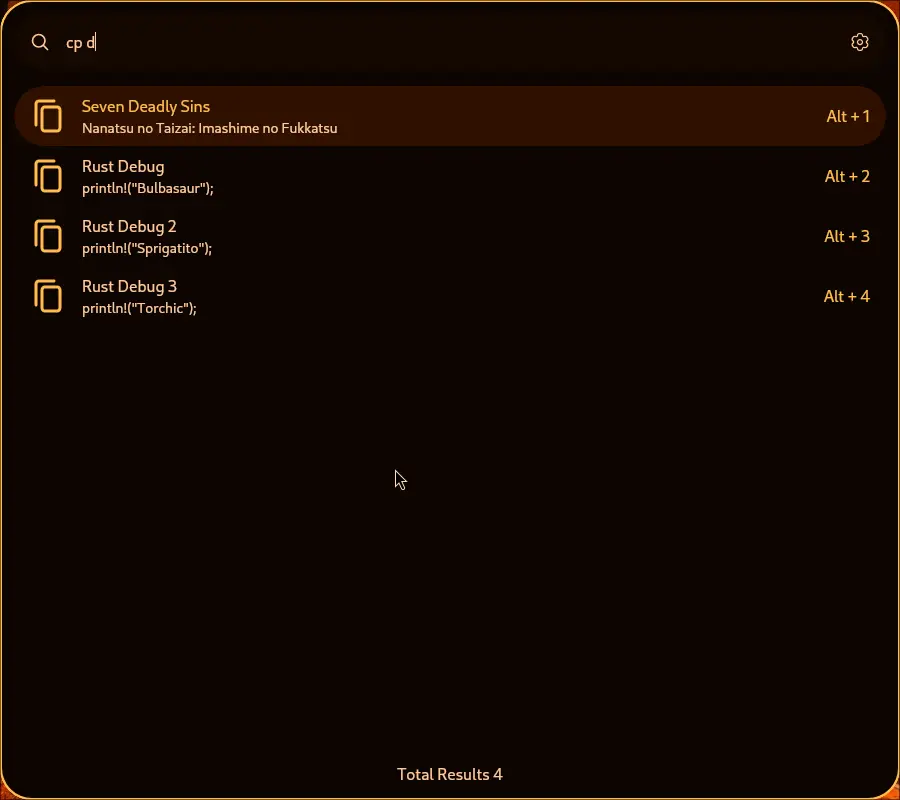

# Clipboard Extension
Quickly copy your favourite text and images to the clipboard 



## Usage
## Add a text/image to the clipboard database
Just run the extension, select the appropriate function and fill the fields

## Delete 
To delete an item from the clipboard do `d` or `delete` and the name of the item and run the appropriate action
```
{keyword} d {name}
```

```
{keyword} delete {name}
```

## Edit
Similar to delete but use `e` or `edit` to do the action.
```
{keyword} e {name}
```

```
{keyword} edit {name}
```